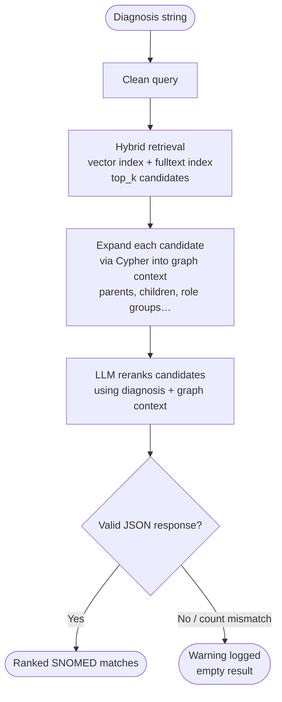
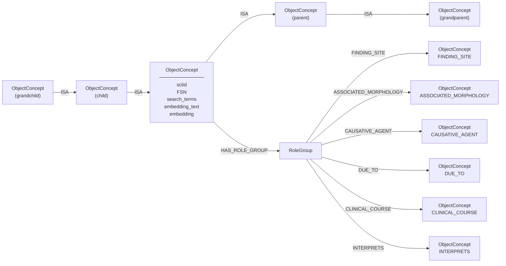
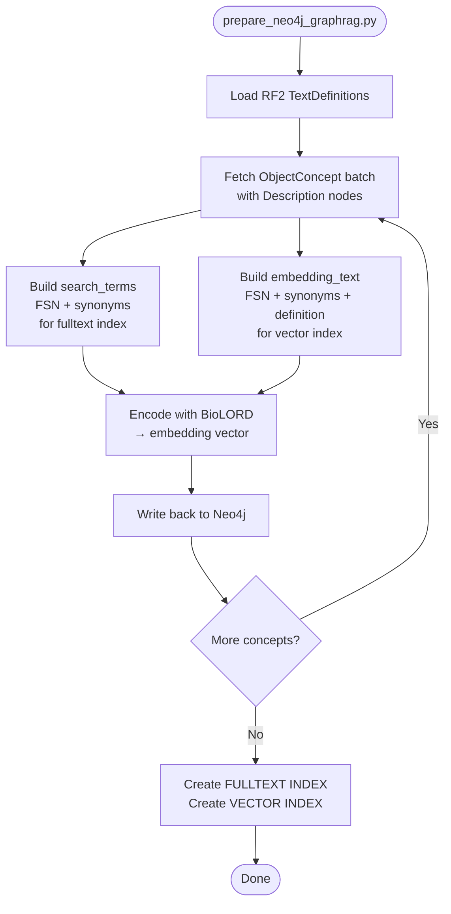

# GraphRAG Workflow

> [!NOTE]
> Implemented in [`graphrag_matcher.py`](../src/concept_normalisation/graphrag/graphrag_matcher.py), orchestrated by [`pipeline/graphrag.py`](../src/concept_normalisation/pipeline/graphrag.py).

---

## 1. Pipeline Workflow

---

## 2. SNOMED CT Schema in Neo4j

| Relationship            | Description                                                                  |
| ----------------------- | ---------------------------------------------------------------------------- |
| `ISA`                   | Is-a hierarchy; traversed 2 levels up (parents) and 2 levels down (children) |
| `HAS_ROLE_GROUP`        | Groups one or more role-filler relationships; a concept can have many        |
| `FINDING_SITE`          | Body structure where the finding occurs                                      |
| `ASSOCIATED_MORPHOLOGY` | Structural/tissue change (e.g. infarct, inflammation)                        |
| `CAUSATIVE_AGENT`       | Organism or substance causing the disorder                                   |
| `DUE_TO`                | Causal condition or event                                                    |
| `CLINICAL_COURSE`       | Temporal pattern (e.g. acute, chronic)                                       |
| `INTERPRETS`            | Observable entity being interpreted                                          |

---

## 3. Neo4j Enrichment Script

Run once before GraphRAG can be used. Source: [`scripts/prepare_neo4j_graphrag.py`](../scripts/prepare_neo4j_graphrag.py).

### Configuration knobs

| Config key                      | Default                     | Effect                                                                                      |
| ------------------------------- | --------------------------- | ------------------------------------------------------------------------------------------- |
| `GRAPHRAG_EMBEDDING_MODEL_NAME` | `FremyCompany/BioLORD-2023` | Embedding model — must match between enrichment and query time                              |
| `GRAPHRAG_FETCH_BATCH_SIZE`     | `2000`                      | Concepts fetched per Neo4j round-trip                                                       |
| `GRAPHRAG_EMBEDDING_BATCH_SIZE` | `256`                       | Texts encoded per model call                                                                |
| `GRAPHRAG_WRITE_BATCH_SIZE`     | `500`                       | Concepts updated per Neo4j write                                                            |
| `GRAPHRAG_DEFAULT_TOP_K`        | `5`                         | Candidates retrieved at query time; higher values increase LLM context and can hurt ranking |

> [!IMPORTANT]
> The embedding model must be the same at enrichment time and at query time. Mismatching models will silently produce poor retrieval.

> [!TIP]
> Use `--force` to rebuild all embeddings, e.g. after switching the embedding model.
